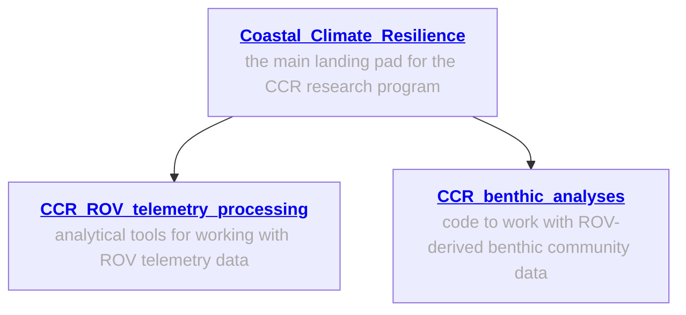
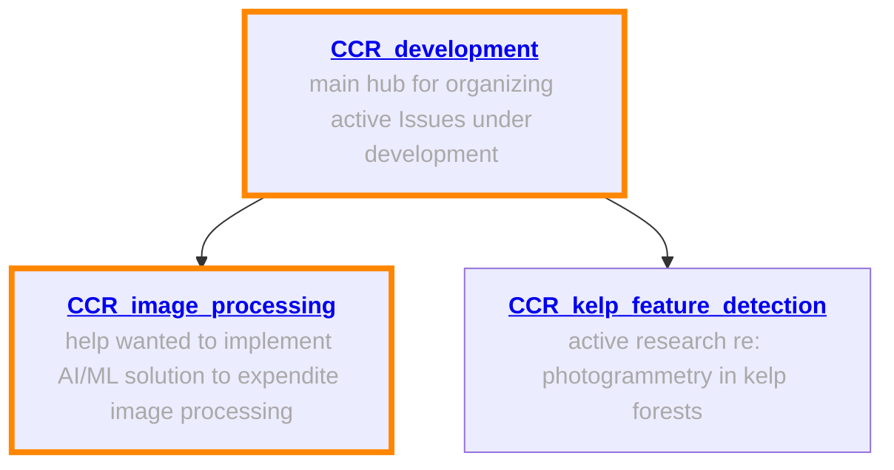

# CCR ROV telemetry processing

## Overview

This repository walks interested parties through the sequence for ROV field work, from ROV set-up to extracting relavent telelmetry information from surveys. You can find code to organize information regarding the analysis and visualization of ROV telemetry information. 
Our overarching objective here is to provide an open-source location where other entities can learn our survey methods and modify them to their intended use. 

## ROV, sensors, modifications 
### 🤖 ROV
* [BlueROV2](https://bluerobotics.com/store/rov/bluerov2/) by BlueRobotics with heavy configuration upgrade and 150m tether 
* Modifications: kelp gaurds made with heavy plastic to reduce snagging on kelp stipes while surveying 

### ⚡ Power
* [Outland Technology Power Supply](https://bluerobotics.com/store/comm-control-power/powersupplies-batteries/otps1kw/) for the BlueROV2 
* Outland Technology [tether reel](https://www.outlandtech.com/resources/rovtetherresources) for BlueROV2: RL-750-2 
### :flashlight: Lights 
* x4 [Kraken Solar Flare Mini 18000](https://krakensports.ca/product/solar-flare-mini-18000/) 
* x4 [Ultralight AD-1420-IK](https://ulcs.com/product/ad-1420-ik-base-adapter/?srsltid=AfmBOoqhjfKVo0aI3aMI6ZeeyEz2tsy--UoIa0qY0KNQkLEsrkHGSEGb) universal ball adapter attached to ROV frame 
* Light mounts 

### 𖦏 Additional Sensors
* Water Linked [doppler velcoty log (DVL)](https://bluerobotics.com/store/the-reef/dvl-a50/) A50 

### :camera: Cameras
* [GoPro Hero Black 12/13 ](https://gopro.com/en/us/shop/cameras/buy/hero13black/CHDHX-131-master.html?utm_source=google&utm_medium=paidsearch&utm_campaign=dr&utm_content=websitevisitors&utm_creative_format=pMax&gad_source=1&gad_campaignid=22037678378&gbraid=0AAAAAD76j2AHBF9raMDpYgFuZwoEYm0_o&gclid=CjwKCAiA_dDIBhB6EiwAvzc1cPF1aQaWusdY5SmscSP77gFAdyGCU93zl6fdEFb3VDqMd5RVHKXM1xoCDusQAvD_BwE)
* [Protective Housing ](https://gopro.com/en/us/shop/mounts-accessories/protective-housing-plus-waterproof-case/ADDIV-001.html?srsltid=AfmBOoo5OwOfbXAGL6kS53kSlPQgWMMVLRcmHy9nGLutxCmRFQ1Ku8qU)
* [GoPro Labs ](https://gopro.com/en/bn/info/gopro-labs?utm_source=google&utm_medium=paidsearch&utm_campaign=dr&utm_content=websitevisitors&utm_creative_format=rsa&gad_source=1&gad_campaignid=22035106454&gbraid=0AAAAAD76j2DtE7GHehkAfJwhRIS7xKIED&gclid=CjwKCAiA_dDIBhB6EiwAvzc1cE6AFgDXkbaX8yQ576ZY3gDKtNwd4sWPnv204CvuBC8mAfw5_SJ0bBoCk5EQAvD_BwE)
* Camera time sync: https://gopro.github.io/labs/control/precisiontime/

## 🗺️ Positioning 
* Walterlinked [Underwater GPS G2 Standard Kit](https://www.waterlinked.com/shop/underwater-gps-g2-standard-kit-132?hsLang=en&utm_term=3d+sonar&utm_campaign=WL+-+EN+-+G+-+Navigation+-+Sonar&utm_source=adwords&utm_medium=ppc&hsa_acc=5034108088&hsa_cam=21123984177&hsa_grp=161106978238&hsa_ad=694750692647&hsa_src=g&hsa_tgt=kwd-296873283014&hsa_kw=3d+sonar&hsa_mt=b&hsa_net=adwords&hsa_ver=3&gad_source=1&gad_campaignid=21123984177&gbraid=0AAAAACrr5dGrC_E0Dmi2Kw6OhTir2Y4Nb&gclid=CjwKCAiA_dDIBhB6EiwAvzc1cIg1pw5SwXGqtiufAkhsPUeX9ZmazmQNp-RUpyFbC53Go-ZlUWze2hoCBKgQAvD_BwE#attribute_values=59)
  * Contains Underwater GPS G2 Topside, Locator U1, Antenna
* [GNSS Compass ](https://landing.advancednavigation.com/inertial-navigation-systems/satellite-compass/gnss-compass/)
   
## Command Console 
* Pelican case
* Rugged laptop with bright screen
* 19 inch sunlight readable [monitor](https://www.lcdpart.com/products/ms190w1610nt-19-inch-sunlight-readable-open-frame-monitor-1200-nits?srsltid=AfmBOoo7oCJL82KUDJrykjdpIv38Iq-gy-bCiuF3ubEPghvvUVEmp_cA)

## General information; workflows ready to implement
The following repos contain general information about our work, and specialized repos for ROV telemetry analyses, processing and analyses of ROV-derived benthic abundance and distribution data.

## Telemetry processing

### Code 
* `tlog_csv_no_EKF.py`: This script processes telemetry `.tlog` files from BlueOS when there is no fusion between the GPS and Doppler Velocity Log (DVL). It extracts relevant fields (e.g., time, date, GPS latitude/longitude, DVLx, DVLy (`LOCAL_POSITION_NED`), altitude, depth, heading) and averages values per second. Additionally, it calculates DVL-based latitude and longitude (`DVLlat`, `DVLlon`) from DVLx and DVLy movements and estimates the width (m) and area (m²) captured by GoPro images based on the ROV's altitude. If the survey start and end times are known, they can be specified when running the script; otherwise, the entire `.tlog` file will be processed.

* `tlog_to_csv_EKF.py`: This script processes `.tlog` files when GPS and DVL data are fused via an Extended Kalman Filter (EKF), producing more accurate tracks than using GPS or DVL alone. Instead of calculating `DVLlat`/`DVLlon`, this script incorporates the fused position data (`GLOBAL_POSITION_INT`) for improved accuracy.

   

* `transect_map.py`: This script generates a Leaflet map displaying the ROV tracks as measured by different navigation sources: GPS (black), DVL (blue), and EKF (red), which can then be incorporated into broader maps, as depicted below for the Urban Kelp Research Project with the Port of Seattle 

   

  

---

## Help wanted! 
The following repos involve active areas of open-source software development, AI/ML implementation, and computer vision challenges; areas where we could use assistance are 🔶 highlighted in orange 🔶

