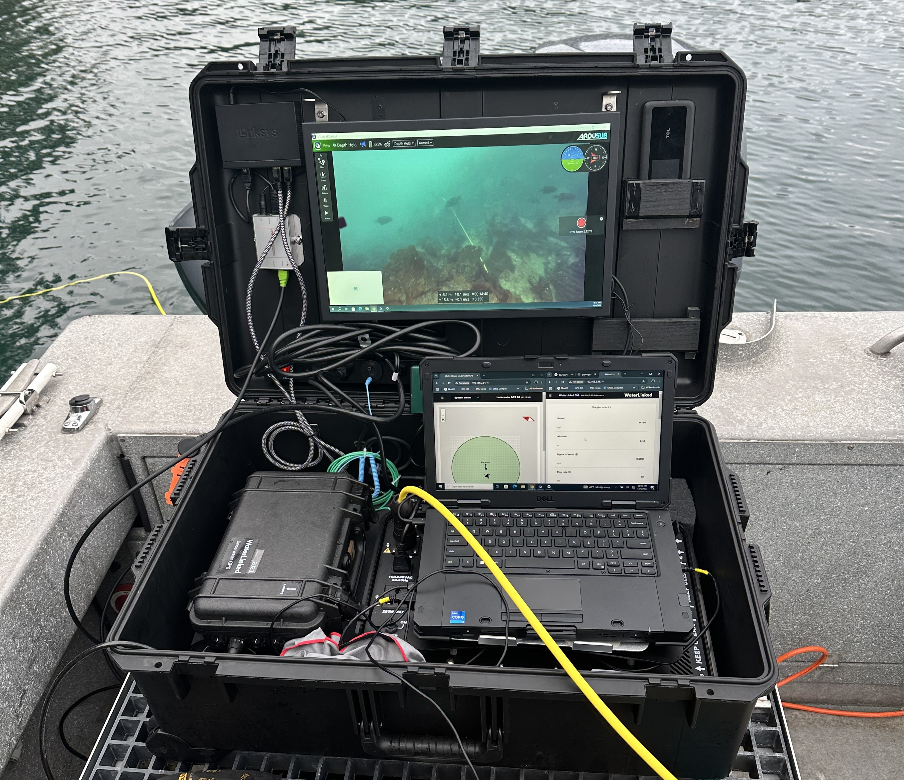
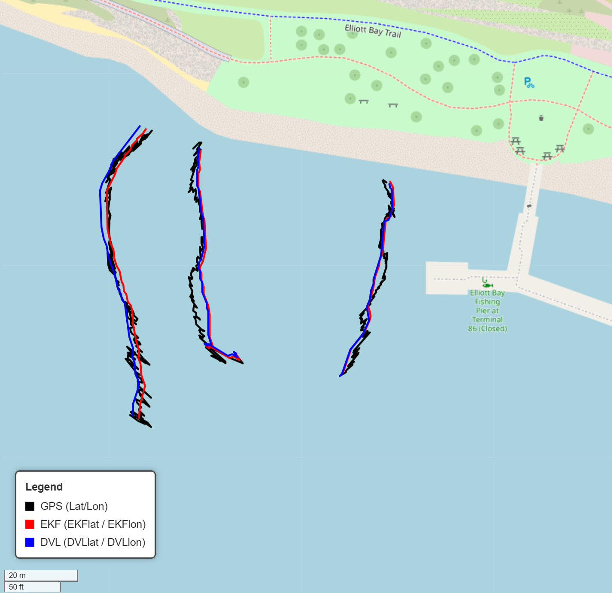
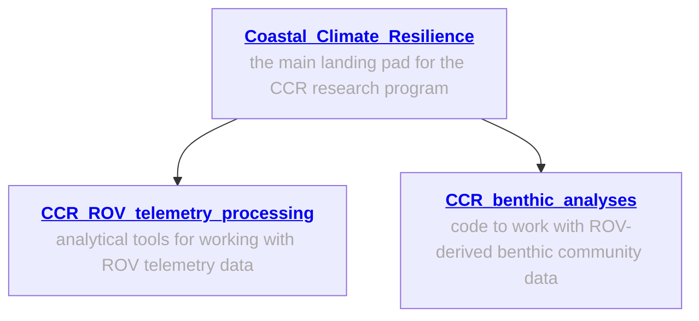
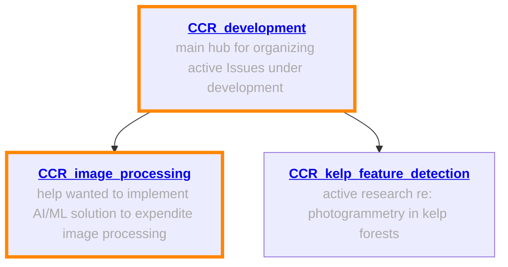

# CCR ROV Survey Methods  

## 🌊 Overview  

This repository provides an overview of the Seattle Aquarium’s Coastal Climate Resilience (CCR) team’s remotely operated vehicle (ROV) survey workflow — spanning hardware configuration, field operations, data extraction, and visualization. It includes code and documentation for processing and organizing ROV telemetry data collected during benthic habitat surveys.

Our methods are designed for subtidal monitoring of nearshore habitats in the temperate waters of Puget Sound, where visibility and environmental conditions can be highly variable. Surveys are optimized to collect high-resolution, georeferenced imagery to support analyses of seafloor composition, kelp and algal cover, and associated benthic communities.

Our goal is to create an **open-source reference** that allows other research groups to understand, replicate, and adapt our methods for their own underwater survey applications.  

---

## ⚙️ Hardware  

### 🤖 ROV Platform  
- [**BlueROV2**](https://bluerobotics.com/store/rov/bluerov2/) (Blue Robotics) — Heavy Configuration with 150 m tether  
- **Navigator Flight Controller** (with Raspberry Pi 4, 8 GB Model B)  
- **Modifications:** Custom “kelp guards” fabricated from HDPE plastic to minimize entanglement with kelp stipes during surveys

   

### ⚡ Power and Tether Management  
- [**Outland Technology Power Supply (OTPS-1kW)**](https://bluerobotics.com/store/comm-control-power/powersupplies-batteries/otps1kw/)  
- [**Outland Technology Tether Reel (RL-750-2)**](https://www.outlandtech.com/resources/rovtetherresources)  

### 💡 Lighting  
- 4 × [**Kraken Solar Flare Mini 18,000**](https://krakensports.ca/product/solar-flare-mini-18000/) video lights  
- 4 × [**Ultralight AD-1420-IK**](https://ulcs.com/product/ad-1420-ik-base-adapter/?srsltid=AfmBOoqhjfKVo0aI3aMI6ZeeyEz2tsy--UoIa0qY0KNQkLEsrkHGSEGb) universal ball adapters mounted to ROV frame   

### 📡 Additional Sensors  
- **Water Linked DVL A50** — Doppler Velocity Log for local positioning  
  - Firmware: v1.0.8 (updated 2025-07-24)  

### 🎥 Cameras  
- [**GoPro Hero 12 / 13 Black**](https://gopro.com/en/us/shop/cameras/buy/hero13black/CHDHX-131-master.html)  
- [**Protective Housing**](https://gopro.com/en/us/shop/mounts-accessories/protective-housing-plus-waterproof-case/ADDIV-001.html)  
- [**GoPro Labs**](https://gopro.com/en/bn/info/gopro-labs) firmware for time synchronization and advanced scripting  

**Camera configuration (for still-image transects):**  

| Setting | Value |
|----------|--------|
| Mode | Photo |
| Interval | 3s |
| Lens | Wide |
| Output | RAW (.GPR) |
| EV Comp | 0 |
| White Balance | Native |
| ISO Min–Max | 100–200 |
| Sharpness | Low |
| Color | Flat |
| Shutter Speed | 1/300 s (`!MEXPX=300` via GoPro Labs) |

**Time synchronization:** [GoPro Precision Time](https://gopro.github.io/labs/control/precisiontime/)  

---

## 🗺️ Positioning and Navigation  

- [**Water Linked Underwater GPS G2 Standard Kit**](https://www.waterlinked.com/shop/underwater-gps-g2-standard-kit-132)  
  - Components: G2 Topside, Locator U1, Antenna  
  - Firmware: v3.3.4 (updated 2025-08-15)  

- [**Advanced Navigation Satellite Compass**](https://landing.advancednavigation.com/inertial-navigation-systems/satellite-compass/gnss-compass/)  
  - Firmware: v2.47 (updated 2025-08-08)  

- **NMEA network integration** for synchronized positioning across all sensors  

---

## 💻 Command Console  

- Custom **Pelican case** housing the surface control system  
- Ruggedized **laptop** for mission control (BlueOS / QGroundControl)  
- **19-inch sunlight-readable monitor** ([MS190W1610NT](https://www.lcdpart.com/products/ms190w1610nt-19-inch-sunlight-readable-open-frame-monitor-1200-nits))  
- **Ethernet switch** for network connectivity between ROV, GPS, DVL, and camera control systems  

   

---

## 🧠 Firmware and Software  

### BlueOS Configuration  
- **ArduSub:** v4.5.3 (updated 2025-07-24)  
- [**DVL Extension**](https://github.com/bluerobotics/BlueOS-Water-Linked-DVL): v1.0.8  
- [**UGPS Extension**](https://github.com/waterlinked/blueos-ugps-extension): v1.0.7  
  - Modified configuration with `EXTRA_ARGS=--ignore_gps` for improved sensor fusion  
- [**Surftrack Fixit**](https://github.com/clydemcqueen/surftrak_fixit): v1.0.0-beta.2  
- [**Water Linked External UGPS Extension**](https://github.com/clydemcqueen/wl_ugps_external_extension)  
  - Provides external (vessel) position and heading data to the Water Linked UGPS system  

---

## 🧮 Telemetry Processing  

### Code 

* `tlog_to_csv.py`: This script processes `.tlog` files when GPS and DVL data are fused via an Extended Kalman Filter (EKF), producing more accurate tracks than using GPS or DVL alone. Instead of calculating `DVLlat`/`DVLlon`, this script incorporates the fused position data (`GLOBAL_POSITION_INT`) for improved accuracy.

   

* `transect_map.py`: This script generates a Leaflet map displaying the ROV tracks as measured by different navigation sources: GPS (black), DVL (blue), and EKF (red).

   

---
## General information; workflows ready to implement
The following repos contain general information about our work, and specialized repos for ROV telemetry analyses, processing and analyses of ROV-derived benthic abundance and distribution data.

## Help wanted! 
The following repos involve active areas of open-source software development, AI/ML implementation, and computer vision challenges; areas where we could use assistance are 🔶 highlighted in orange 🔶

