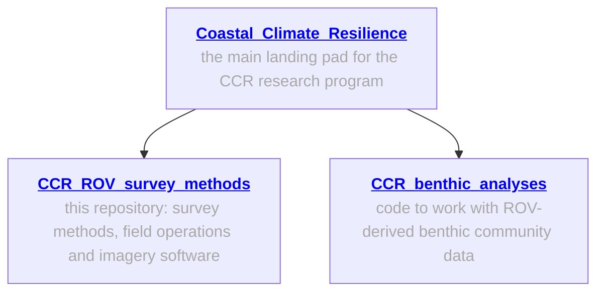
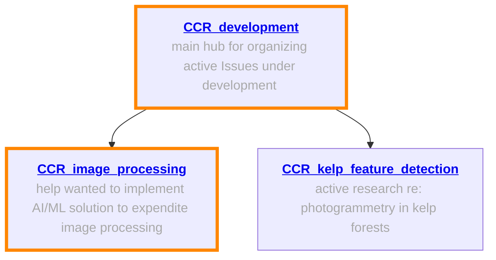

# CCR ROV Survey Methods  

## 🌊 Overview  

This repository provides an overview of the Seattle Aquarium’s Coastal Climate Resilience (CCR) team’s remotely operated vehicle (ROV) survey workflow — spanning hardware configuration, field operations, telemetry data extraction, and visualization. It includes two open-source desktop applications that streamline field operations and imagery processing, along with the code and data behind our survey-methods manuscript.

Our methods are designed for subtidal monitoring of nearshore habitats in the temperate waters of Puget Sound, where visibility and environmental conditions can be highly variable. Surveys are optimized to collect high-resolution, georeferenced imagery to support analyses of seafloor composition, kelp and algal cover, and associated benthic communities.

Our goal is to create an **open-source reference** that allows other research groups to understand, replicate, and adapt our methods for their own underwater survey applications.  

---

## ⚙️ Hardware  

### 🤖 ROV Platform  
- [**BlueROV2**](https://bluerobotics.com/store/rov/bluerov2/) (Blue Robotics) — Heavy Configuration with 150 m tether  
- **Navigator Flight Controller** (with Raspberry Pi 4, 8 GB Model B)  
- **Modifications:** Custom “kelp guards” fabricated from HDPE plastic to minimize entanglement with kelp stipes during surveys

   

### ⚡ Power and Tether Management  
- [**Outland Technology Power Supply (OTPS-1kW)**](https://bluerobotics.com/store/comm-control-power/powersupplies-batteries/otps1kw/)  
- [**Outland Technology Tether Reel (RL-750-2)**](https://www.outlandtech.com/resources/rovtetherresources)  

### 💡 Lighting  
- 4 × [**Kraken Solar Flare Mini 18,000**](https://krakensports.ca/product/solar-flare-mini-18000/) video lights  
- 4 × [**Ultralight AD-1420-IK**](https://ulcs.com/product/ad-1420-ik-base-adapter/?srsltid=AfmBOoqhjfKVo0aI3aMI6ZeeyEz2tsy--UoIa0qY0KNQkLEsrkHGSEGb) universal ball adapters mounted to ROV frame   

### 📡 Additional Sensors  
- **Water Linked DVL A50** — Doppler Velocity Log for local positioning  
  - Firmware: v1.0.8 (updated 2025-07-24)  

### 🎥 Cameras  
- [**GoPro Hero 12 / 13 Black**](https://gopro.com/en/us/shop/cameras/buy/hero13black/CHDHX-131-master.html)  
- [**Protective Housing**](https://gopro.com/en/us/shop/mounts-accessories/protective-housing-plus-waterproof-case/ADDIV-001.html)  
- [**GoPro Labs**](https://gopro.com/en/bn/info/gopro-labs) firmware for time synchronization and advanced scripting  

**Camera configuration (for downward-facing imagery):**  

| Setting | Value |
|----------|--------|
| Mode | Photo |
| Interval | 3s |
| Lens | Wide |
| Output | RAW (.GPR) |
| EV Comp | 0 |
| White Balance | Native |
| ISO Min–Max | 100–200 |
| Sharpness | Low |
| Color | Flat |
| Shutter Speed | 1/300 s (`!MEXPX=300` via GoPro Labs) |

**Time synchronization:** [GoPro Precision Time](https://gopro.github.io/labs/control/precisiontime/)  

---

## 🗺️ Positioning and Navigation  

- [**Water Linked Underwater GPS G2 Standard Kit**](https://www.waterlinked.com/shop/underwater-gps-g2-standard-kit-132)  
  - Components: G2 Topside, Locator U1, Antenna  
  - Firmware: v3.3.4 (updated 2025-08-15)  

- [**Advanced Navigation Satellite Compass**](https://landing.advancednavigation.com/inertial-navigation-systems/satellite-compass/gnss-compass/)  
  - Firmware: v2.47 (updated 2025-08-08)  

- **NMEA network integration** for synchronized positioning across all sensors  

---

## 💻 Command Console  

- Custom **Pelican case** housing the surface control system  
- Ruggedized **laptop** for mission control (Cockpit / BlueOS)  
- **19-inch sunlight-readable monitor** ([MS190W1610NT](https://www.lcdpart.com/products/ms190w1610nt-19-inch-sunlight-readable-open-frame-monitor-1200-nits))  
- **Ethernet switch** for network connectivity between ROV, GPS, DVL, and camera control systems  

   

---

## 🧠 Firmware and Software  

### BlueOS Configuration  
- **ArduSub:** v4.5.3 (updated 2025-07-24)  
- [**DVL Extension**](https://github.com/bluerobotics/BlueOS-Water-Linked-DVL): v1.0.8  
- [**UGPS Extension**](https://github.com/waterlinked/blueos-ugps-extension): v1.0.7  
  - Modified configuration with `EXTRA_ARGS=--ignore_gps` for improved sensor fusion  
- [**Surftrack Fixit**](https://github.com/clydemcqueen/surftrak_fixit): v1.0.0-beta.2  
- [**Water Linked External UGPS Extension**](https://github.com/clydemcqueen/wl_ugps_external_extension)  
  - Provides external (vessel) position and heading data to the Water Linked UGPS system  

---

## 🧰 Field and Imagery Software

Two open-source Windows desktop applications carry a survey day from pre-dive checks to analysis-ready imagery. Each installs from a double-click launcher into its own Python environment, and the two share only the day's flight folder, where the transect times written by one drive the other.

### [ROV Flight Operations](rov_flight_ops/) (`rov_flight_ops/`)

Runs on the topside laptop for the whole survey day, with tabs in the order the day uses them: automatic recording of laptop and tether health whenever the ROV is armed; a live navigation map with survey plans, line-following guidance and a navigation-sensor readiness check; transect times (and pauses) checked against the dive profile; verified download of BlueOS logs and imagery from the vehicle; an automated flight report that diagnoses disarms, tether dropouts and sensor faults; and per-transect telemetry CSVs and maps from the bundled transect extractor ([`mcap_to_csv/`](mcap_to_csv/)). See [`rov_flight_ops/README.md`](rov_flight_ops/README.md).

  

### [ROV Imagery Processing](rov_imagery_processing/) (`rov_imagery_processing/`)

Turns a day's raw imagery into sorted, developed and telemetry-annotated products using the same transect times: imports GoPro photos straight from the SD card into per-transect folders (optionally one photo per meter traveled); batch-develops GoPro RAW (`.GPR`) photos in Adobe Lightroom Classic (crop, chromatic-aberration removal, AI Denoise); and trims each transect's video and composites it with the ROV's telemetry and forward camera. See [`rov_imagery_processing/README.md`](rov_imagery_processing/README.md).

  

---
## General information; workflows ready to implement
The following repos contain general information about our work, and specialized repos for ROV telemetry analyses, processing and analyses of ROV-derived benthic abundance and distribution data.

```mermaid
graph TD

A["<a href='https://github.com/Seattle-Aquarium/Coastal_Climate_Resilience' target='_blank' style='font-size: 16px; font-weight: bold;'>Coastal_Climate_Resilience</a><br><font color='darkgray'>the main landing pad for the CCR research program</font>"]

A --> E["<a href='https://github.com/Seattle-Aquarium/CCR_ROV_survey_methods' target='_blank' style='font-size: 16px; font-weight: bold;'>CCR_ROV_survey_methods</a><br><font color='darkgray'>this repository: survey methods, field operations and imagery software</font>"]

A --> F["<a href='https://github.com/Seattle-Aquarium/CCR_benthic_analyses' target='_blank' style='font-size: 16px; font-weight: bold;'>CCR_benthic_analyses</a><br><font color='darkgray'>code to work with ROV-derived benthic community data</font>"]


```

## Help wanted! 
The following repos involve active areas of open-source software development, AI/ML implementation, and computer vision challenges; areas where we could use assistance are 🔶 highlighted in orange 🔶

```mermaid
graph TD

B["<a href='https://github.com/Seattle-Aquarium/CCR_development' target='_blank' style='font-size: 16px; font-weight: bold;'>CCR_development</a><br><font color='darkgray'>main hub for organizing active Issues under development </font>"]

B --> C["<a href='https://github.com/Seattle-Aquarium/CCR_image_processing' target='_blank' style='font-size: 16px; font-weight: bold;'>CCR_image_processing</a><br><font color='darkgray'>help wanted to implement AI/ML solution to expendite image processing</font>"]

B --> D["<a href='https://github.com/Seattle-Aquarium/CCR_kelp_feature_detection' target='_blank' style='font-size: 16px; font-weight: bold;'>CCR_kelp_feature_detection</a><br><font color='darkgray'>active research re: photogrammetry in kelp forests</font>"]

style B stroke:#FF8600,stroke-width:4px
style C stroke:#FF8600,stroke-width:4px
```

