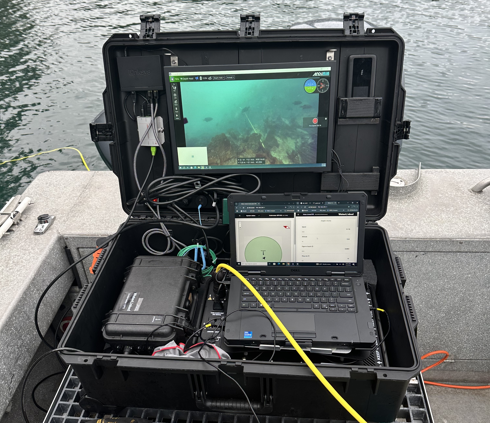
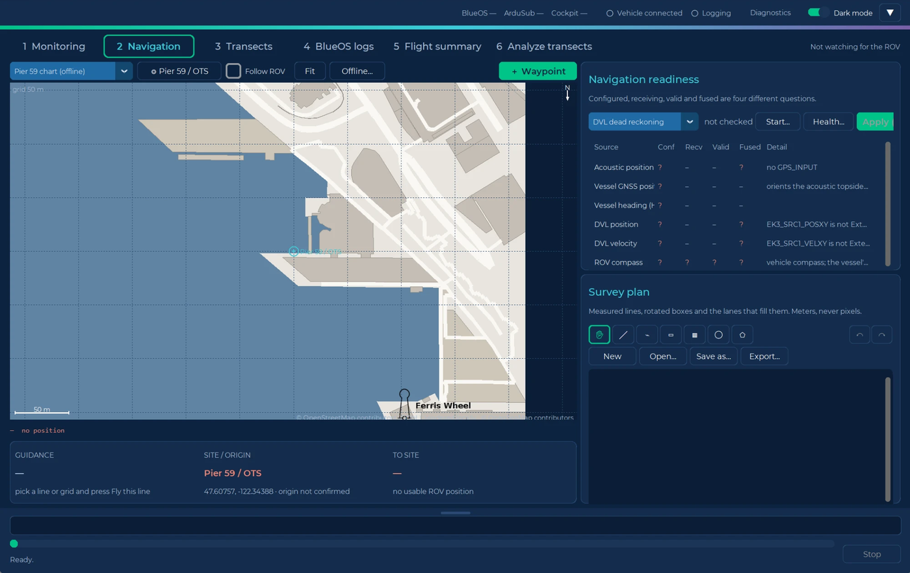
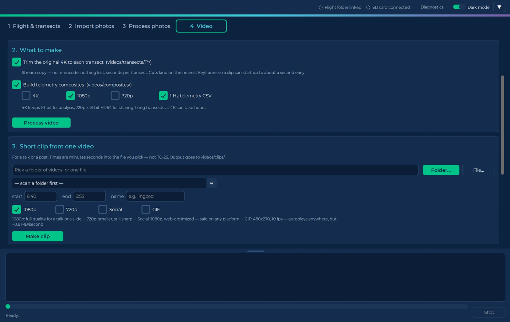

# CCR ROV Survey Methods  

## 🌊 Overview  

This repository provides an overview of the Seattle Aquarium’s Coastal Climate Resilience (CCR) team’s remotely operated vehicle (ROV) survey workflow — spanning hardware configuration, field operations, telemetry data extraction, and visualization. It includes two open-source desktop applications that streamline field operations and imagery processing, along with the code and data behind our survey-methods manuscript.

Our methods are designed for subtidal monitoring of nearshore habitats in the temperate waters of Puget Sound, where visibility and environmental conditions can be highly variable. Surveys are optimized to collect high-resolution, georeferenced imagery to support analyses of seafloor composition, kelp and algal cover, and associated benthic communities.

Our goal is to create an **open-source reference** that allows other research groups to understand, replicate, and adapt our methods for their own underwater survey applications.  

### 📂 Repository contents

| Folder | What it holds | Manuscript items |
|---|---|---|
| [`rov_flight_ops/`](rov_flight_ops/) | ROV Flight Operations desktop app for the survey day (see [below](#-field-and-imagery-software)) | Supp. Section S4, Fig. S6 |
| [`rov_imagery_processing/`](rov_imagery_processing/) | ROV Imagery Processing desktop app for photos and video (see [below](#-field-and-imagery-software)) | Supp. Section S4 |
| [`mcap_to_csv/`](mcap_to_csv/) | Transect extractor: BlueOS `.mcap` recordings to per-transect 1 Hz CSVs and maps; runs on its own or inside ROV Flight Operations | Table S3 |
| [`code/`](code/) | Stand-alone Python scripts that preceded the two apps (`tlog_to_csv.py`, `transect_map.py`, `meter_mark.py`, `rename_jpg_gpr_EXIF.py`, `MAVLink_listen.py`, `optimize_path.py`) and `surftrak_performance.py` | Table S3 |
| [`code/transect_tracks/`](code/transect_tracks/) | R code and transect CSVs for the ROV positioning-track figure | Fig. 2 |
| [`surftrak_analysis/`](surftrak_analysis/) | Output of `code/surftrak_performance.py`: surftrak altitude error per transect, survey day and year, and its histogram | Table S1, Fig. S2 |
| [`tlog_visualization/`](tlog_visualization/) | R code, data and figures for surftrak altitude holding and ROV power use | Figs. 3–4, S11, S13 |
| [`lighting/`](lighting/) | Lighting-control subsystem for the V4 lights: Raspberry Pi Pico code, wiring, parts list and a lighting simulation | Fig. S8, Table S4 |
| [`lua_scripts/`](lua_scripts/) | ArduSub Lua scripts: `surftrak2.lua`, `transect3.lua`, `message_interval.lua`, `ahrs-set-origin.lua` | Table S2 |
| [`field_checklist/`](field_checklist/) | One-page printable field log (LaTeX source and PDF) | Fig. S1 |
| [`sort_by_meter_mark/`](sort_by_meter_mark/) | Example output of `optimize_path.py` and meter-mark photo sorting for three transects | — |
| [`images/`](images/) | Images used in this README | — |

---

## ⚙️ Hardware  

### 🤖 ROV Platform  
- [**BlueROV2**](https://bluerobotics.com/store/rov/bluerov2/) (Blue Robotics) — Heavy Configuration with 150 m tether  
- **Navigator Flight Controller** (with Raspberry Pi 4, 8 GB Model B)  
- **Modifications:** Custom “kelp guards” fabricated from HDPE plastic to minimize entanglement with kelp stipes during surveys

   

### ⚡ Power and Tether Management  
- [**Outland Technology Power Supply (OTPS-1kW)**](https://bluerobotics.com/store/comm-control-power/powersupplies-batteries/otps1kw/)  
- [**Outland Technology Tether Reel (RL-750-2)**](https://www.outlandtech.com/resources/rovtetherresources)  

### 💡 Lighting  
- 4 × [**Kraken Solar Flare Mini 18,000**](https://krakensports.ca/product/solar-flare-mini-18000/) video lights  
- 4 × [**Ultralight AD-1420-IK**](https://ulcs.com/product/ad-1420-ik-base-adapter/?srsltid=AfmBOoqhjfKVo0aI3aMI6ZeeyEz2tsy--UoIa0qY0KNQkLEsrkHGSEGb) universal ball adapters mounted to ROV frame   

### 📡 Additional Sensors  
- **Water Linked DVL A50** — Doppler Velocity Log for local positioning  
  - Firmware: v1.0.8 (updated 2025-07-24)  

### 🎥 Cameras  
- [**GoPro Hero 12 / 13 Black**](https://gopro.com/en/us/shop/cameras/buy/hero13black/CHDHX-131-master.html)  
- [**Protective Housing**](https://gopro.com/en/us/shop/mounts-accessories/protective-housing-plus-waterproof-case/ADDIV-001.html)  
- [**GoPro Labs**](https://gopro.com/en/bn/info/gopro-labs) firmware for time synchronization and advanced scripting  

**Camera configuration (for downward-facing imagery):**  

| Setting | Value |
|----------|--------|
| Mode | Photo |
| Interval | 3s |
| Lens | Wide |
| Output | RAW (.GPR) |
| EV Comp | 0 |
| White Balance | Native |
| ISO Min–Max | 100–200 |
| Sharpness | Low |
| Color | Flat |
| Shutter Speed | 1/300 s (`!MEXPX=300` via GoPro Labs) |

**Time synchronization:** [GoPro Precision Time](https://gopro.github.io/labs/control/precisiontime/)  

---

## 🗺️ Positioning and Navigation  

- [**Water Linked Underwater GPS G2 Standard Kit**](https://www.waterlinked.com/shop/underwater-gps-g2-standard-kit-132)  
  - Components: G2 Topside, Locator U1, Antenna  
  - Firmware: v3.3.4 (updated 2025-08-15)  

- [**Advanced Navigation Satellite Compass**](https://landing.advancednavigation.com/inertial-navigation-systems/satellite-compass/gnss-compass/)  
  - Firmware: v2.47 (updated 2025-08-08)  

- **NMEA network integration** for synchronized positioning across all sensors  

---

## 💻 Command Console  

- Custom **Pelican case** housing the surface control system  
- Ruggedized **laptop** for mission control (Cockpit / BlueOS)  
- **19-inch sunlight-readable monitor** ([MS190W1610NT](https://www.lcdpart.com/products/ms190w1610nt-19-inch-sunlight-readable-open-frame-monitor-1200-nits))  
- **Ethernet switch** for network connectivity between ROV, GPS, DVL, and camera control systems  

   

---

## 🧠 Firmware and Software  

### BlueOS Configuration  
- **ArduSub:** v4.5.3 (updated 2025-07-24)  
- [**DVL Extension**](https://github.com/bluerobotics/BlueOS-Water-Linked-DVL): v1.0.8  
- [**UGPS Extension**](https://github.com/waterlinked/blueos-ugps-extension): v1.0.7  
  - Modified configuration with `EXTRA_ARGS=--ignore_gps` for improved sensor fusion  
- [**Surftrak Fixit**](https://github.com/clydemcqueen/surftrak_fixit): v1.0.0-beta.2  
- [**Water Linked External UGPS Extension**](https://github.com/clydemcqueen/wl_ugps_external_extension)  
  - Provides external (vessel) position and heading data to the Water Linked UGPS system  

---

## 🧰 Field and Imagery Software

Two open-source Windows desktop applications carry a survey day from pre-dive checks to analysis-ready imagery. Each installs from a double-click launcher into its own Python environment, and the two share only the day's flight folder, where the transect times written by one drive the other.

### [ROV Flight Operations](rov_flight_ops/) (`rov_flight_ops/`)

Runs on the topside laptop for the whole survey day, with tabs in the order the day uses them: automatic recording of laptop and tether health whenever the ROV is armed; a live navigation map with survey plans, line-following guidance and a navigation-sensor readiness check; transect times (and pauses) checked against the dive profile; verified download of BlueOS logs and imagery from the vehicle; an automated flight report that diagnoses disarms, tether dropouts and sensor faults; and per-transect telemetry CSVs and maps from the bundled transect extractor ([`mcap_to_csv/`](mcap_to_csv/)). See [`rov_flight_ops/README.md`](rov_flight_ops/README.md).

  

### [ROV Imagery Processing](rov_imagery_processing/) (`rov_imagery_processing/`)

Turns a day's raw imagery into sorted, developed and telemetry-annotated products using the same transect times: imports GoPro photos straight from the SD card into per-transect folders (optionally one photo per meter traveled); batch-develops GoPro RAW (`.GPR`) photos in Adobe Lightroom Classic (crop, chromatic-aberration removal, AI Denoise); and trims each transect's video and composites it with the ROV's telemetry and forward camera. See [`rov_imagery_processing/README.md`](rov_imagery_processing/README.md).

  

---

## 📄 License and citation

Code in this repository is released under the [MIT License](LICENSE). A few bundled files written by others (two Lua scripts, a modified ArduPilot applet, a University of Washington driver library, MicroPython firmware and the Montserrat fonts) keep their own licenses, listed at the end of [`LICENSE`](LICENSE). The Seattle Aquarium name and logos are not covered by the MIT License.

To cite this repository, use the **Cite this repository** button on GitHub, which reads [`CITATION.cff`](CITATION.cff).

---
<!-- CCR-REPO-MAP:START -->
## 🗺️ CCR repositories

The [Seattle Aquarium](https://www.seattleaquarium.org)'s Coastal Climate Resilience (CCR) work spans the repos below. 🔶 = help wanted · 📍 = you are here.

<table>
  <tbody>
  <tr>
    <td colspan="2" align="center">
       
      🌊 <a href="https://github.com/Seattle-Aquarium/Coastal_Climate_Resilience"><b>Coastal_Climate_Resilience</b></a> · start here 
      Program overview, objectives, talks, media coverage, and year-end reports.
    </td>
  </tr>
  <tr><th colspan="2">📚 Core field methods and data analysis</th></tr>
  <tr>
    <td width="50%" valign="top">
       
      🤖 <a href="https://github.com/Seattle-Aquarium/CCR_ROV_survey_methods"><b>CCR_ROV_survey_methods</b></a> 
      ROV hardware, field workflow, and telemetry processing, including custom desktop apps. 
      📍 <b>You are here</b>
    </td>
    <td width="50%" valign="top">
       
      📊 <a href="https://github.com/Seattle-Aquarium/CCR_benthic_analyses"><b>CCR_benthic_analyses</b></a> 
      ML percent-cover classification and object detection, plus community analyses of the resulting data.
    </td>
  </tr>
  <tr><th colspan="2">🖼️ Image processing</th></tr>
  <tr>
    <td width="50%" valign="top">
       
      <i>Unedited frame</i> 
      📷 <a href="https://github.com/Seattle-Aquarium/CCR_image_processing"><b>CCR_image_processing</b></a> 
      The photo-editing bottleneck, with unedited and hand-edited image sets for training and testing.
    </td>
    <td width="50%" valign="top">
       
      <i>Same frame, ML-enhanced</i> 
      ✨ <a href="https://github.com/Seattle-Aquarium/underwater-auto-image-encoder"><b>underwater-auto-image-encoder</b></a> 
      ML pipeline and desktop app that turns raw GoPro photos into survey-ready images.
    </td>
  </tr>
  <tr><th colspan="2">🙋 Get involved</th></tr>
  <tr>
    <td width="50%" valign="top">
      
    </td>
    <td width="50%" valign="top">
      
    </td>
  </tr>
  </tbody>
  <!-- A second tbody restarts GitHub's row shading, so this text row stays white like the other cards. -->
  <tbody>
  <tr>
    <td colspan="2">
      🛠️ <a href="https://github.com/Seattle-Aquarium/CCR_development"><b>CCR_development</b></a> 
      Open Issues and 1-page project descriptions for robotics, telemetry, software, AI/ML, and computer vision work. All research and development is open and is tracked via Git Issues. 
      🔶 <b>Help wanted:</b> pick up an <a href="https://github.com/Seattle-Aquarium/CCR_development/issues">open Issue</a>.
    </td>
  </tr>
  <tr><th colspan="2">🧪 Standalone projects</th></tr>
  <tr>
    <td width="50%" valign="top">
       
      ⚡ <a href="https://github.com/Seattle-Aquarium/ROV_underwater_wireless_charging"><b>ROV_underwater_wireless_charging</b></a> 
      Prototype underwater wireless charging dock for a BlueROV2 at Pier 59, with the UW Applied Physics Lab, Blue Robotics, and WiBotic.
    </td>
    <td width="50%" valign="top">
       
      🌿 <a href="https://github.com/Seattle-Aquarium/understory_kelp_indicator"><b>understory_kelp_indicator</b></a> 
      Puget Sound Understory Kelp Vital Sign indicator, co-developed with Reef Check from diver and ROV surveys.
    </td>
  </tr>
  </tbody>
</table>

📦 Archived projects

 
<a href="https://github.com/Seattle-Aquarium/CCR_kelp_feature_detection"><b>CCR_kelp_feature_detection</b></a>: tested photogrammetry feature detectors on kelp forest imagery. No longer under active development; its 25-image test set and reviewed percent-cover annotations remain available.

