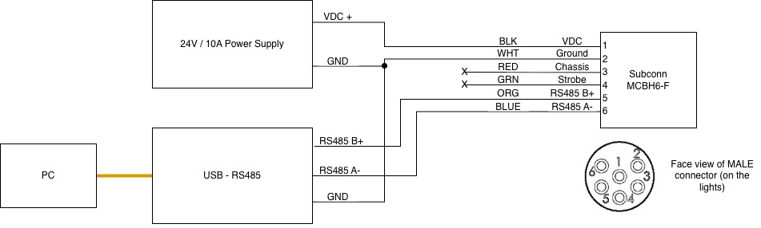

# Setting addresses and configuration RS485 termination resistors on DSPL lights

Deep Sea Power and Light suggested two mitigations to deal with the flickering behavior seen with one of the lights.  They proposed that the flickering might be due to a communication issue due to not-best-design-practices in our implementation:

* All four lights retained the default address of 001. This might lead to bus contention with all four lights replying in parallel.
* All four lights have their internal RS485 termination resistors enabled by default. The 4x parallel configuration might be overdriving the RS485 transmitter causing marginal behavior.

## Hardware setup

A test harness was constructed for communicating with the lights one at a time.  The light recently returned from DSPL was set to come on at full brightness when powered, which necessitated a high-power bench supply (could have used a battery?);  the other three lights on Lutris were off by default.



Note that the Subconn connector used for the test harness complies with their standard color code.  This means the pin 1, which is **DC Power In** for the DSPL lights, is **black**  and pin 2, which is **Ground** is **white.**

## Light configuration

All communication with the lights was done through a serial terminal program.  I used Picocom in Linux.   The lights are configured at the default 9600 baud.

The lights do not echo output.   In the transcripts below, `>`  indicates commands sent to the light, and `<` to indicates the response.   **Do not type the `>`**

The standard DSPL command is of one of two forms

```
!<addr>:<cmd>?<cr><lf>
!<addr>:<cmd>=<value><cr><lf>
```

`<addr>` is a 3-digit device address.   `<cmd>` is a four character command.  

**All commands end in carriage-return-line-feed (`<cr><lf>`), I've omitted them below for clarity.**

Once the light is connected and powered, test connectivity by querying the address (`ADDR`) or temperature (`TEMP`):

```
> !001:ADDR?
< 001
> !001:TEMP?
< 0.00
```

This shows the the light is responding, and it replies that it's address is 001 and temperature is 0.00 (which doesn't seem right?)

To change termination, we follow the [instructions from DSPL](assets/Changing_the_Termination_Resistor_Setting.pdf).   The light needs to be put into a factory configuration mode to "unlock" this setting.

To unlock the light, the command `FACT?` is first queried to get a four-letter passphrase.  This passphrase is then sent back to the light using `FACT=...` to unlock it.  

Once unlocked, the command `FTEN` enables or disables the terminator.  

```
> !001:FACT?
< aZ4F
> !001:FACT=aZ4F
< (blank)

> !001:FTEN?
< 1              (RS485 terminator is enabled)
> !001:FTEN=0
< (blank) 
> !001:FTEN?
< 0              (terminator is now disabled)
```

The result appears to be saved automatically (?)

The address can be set with the noun `ADDR`   ... it's not clear if this needs to be done in factory mode:

```
> !001:ADDR=004  (change to address 4)
< (blank)
> !004:TEMP?     (confirm connection at address 4)
< 0.00
```

