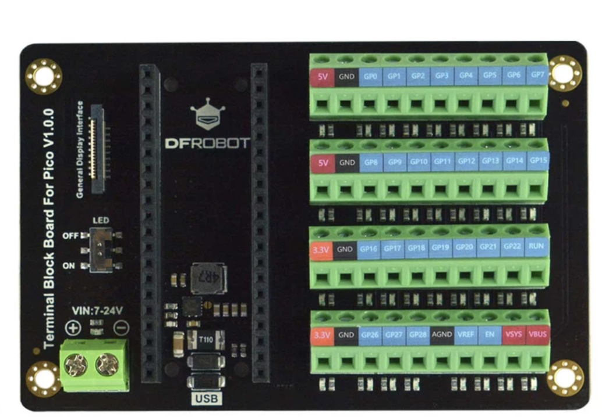
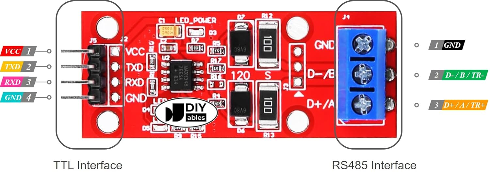

This is the hardware for the lighting subsystem of the ROV.

It attempts to describe the full pinout of the system

## Pins on Raspberry Pi Pico

The pins of the Raspberry pi are shown below. These GP numbers match the labels
in the terminal blocks of the raspberry pi pico shown below.

| Pin | GP# | Function |
|-----|-----|----------|
| 1   | GP0 | UART TX to SeaSense lights |
| 2   | GP1 | UART RX from SeaSense lights |
| 21  | GP16 | PWM input from BlueROV servo output |

Additionally, the power screw terminal VIN, is connected  the voltage converter 24 volt output.

## Connection of UART TX / RX to RS-485 converter

The TX pin (GP0) of the RPi Pico should be connected to the TX of the RS-485 converter.
The RX pin (GP1) of the RPi Pico should be connected to the RX pin of the RS-485 converter.

VCC ping should go to the 5V on the Ri Pi board.
Ground should go to the ground connection.

## RS-485 converter to DeepSea Lights

The Deepsea lights have the following pinout

| Wire Color | Function |
|------------|---------------------------------|
| Black      | DC+ (24 Volt Positive)          |
| White      | DC- (Ground / 24 Volt Negative) |
| Red        | Light Chassis ( do not connect) |
| Green      | Pulse / strobe.                 |
| Orange     | RxD / B+ RS-485                 |
| Blue       | TxD / A- RS-485                 |

For our purposes currently, we only connect four of the light wires.

The DC + and - pins are all connected together and go to the 24 volt supply.

The Orange an blue wires are equally joined together via wago connection blocks or a terminal block. Aka all orange wires connected and all blue wires connected.

Then the connections are made to the RS-485 converter:

Orange of lights goes <-----> D+ / A screw block
Blue of lights goes   <-----> D- / B screw block

## Full bench setup

The full wiring is shown, quite messily here for reference later. 

